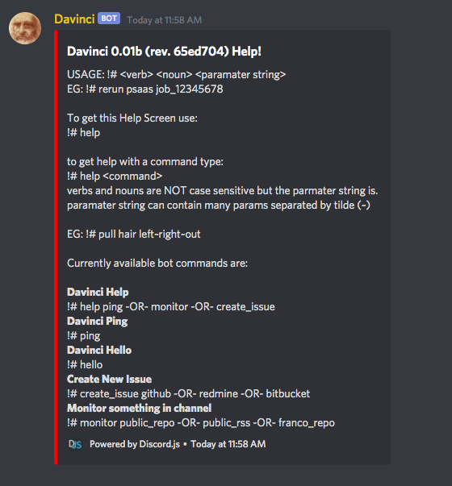

# Develop outline for new administration proposal

## Table of contents

1. [Preamble](#preamble)
2. [Repo Branch Structure](#repo-branch)
3. [New Release Schedule](#release-schedule)
4. [Bug fixes](#bug-fixes)
5. [New Features](#new-features)
6. [New Version Number Format](#version-number)
7. [Dev builds built by testers](#dev-builds)
8. [Redmine Migration to Git Hub](#redmine-migration)
9. [Automatic Community Engagement](#community)

## <a name="preamble"> Preamble</a>
Recently I have been working very closely with HSS on a project for NWT, this experience helped me to clearly see some of the conflicts between project expectations and how that is thwarted by developer needs and tools. As a result, I have envisioned a new approach to managing this project that I think will solve some of our more confounding issues and some of our legacy hangovers that are causing trouble. I would like to focus on consensus first, Initially with Myself and Brett, then further with Neal, Rob & Mac. When we have this level of consensus, I suspect the rest will fall into line. here are the major points to consider.

## <a name="repo-branch"> Repo Branch structure</a>

My recent experiences clearly show how beneficial it is to have a master branch and a developer branch, these have clear use cases and can clear up much confusion. The master channel should be used for Releases (not dev builds), while the developer branch would be used for testing fixes. A further discussion remains to be had if we have a master branch for stable full releases, a beta branch for monthlies and a dev branch. Full stables may be a 6 month release schedule and will be more thoroughly advertised than Beta would be. This ensures the overall user experience is as positive as possible while our Beta community continues to cut the bleeding edge and our developer community is able to source the newest bugs as fast as possible.

Branch management also allows for a logging of progress and work as all commits are tagged and we have a timeline that we can traceback through easily and graphically if needed.

### Quick read on development workflows
[Successful Git Branching Model](https://nvie.com/posts/a-successful-git-branching-model/)

### Where we want to be in the short term

### Where we want to be in the long term

## <a name="release-schedule"> New Release Schedule</a>

Part of our problems stem from a reversal of priorities, currently, this is driven by version numbers, driven by builds, driven by code implementation success by the developer. This approach while doable is neither ideal, nor optimal and lends to the unpredictability of this project. You cant forecast a budget, you cant plan for a release. yet this could very easily be fixed by a new approach. This new approach is currently only a proposal and some variables may require tuning for maximum effectiveness, but in principle it is a s follows:

On the first of each month, the developer will be obligated to provide a Beta Release to the dev team. this release will be done on the master branch and will include the need for full binary distribution. Any and all fixes/features in the developer branch will be merged into the master branch for each monthly release. If there are no changes, this release will still proceed providing us with regular predictable builds that will be known to be stable. 

## <a name="bug-fixes"> Bug fixes</a>

When a bug is reported, it will be fixed immediately in the developer branch. When that bug is then marked as Fixed in Dev branch, it can be tested by BUILDING the project from the developer branch. If it cannot be built this speaks to a problem code management, see [dev builds](#dev-builds) below. Bugs being immediately pushed to the dev branch ensure testers are able to assess the state of the build after each individual bug fix rather than after an accumulation of bug fixes. As these commits are also save states in time we can now identify where things have gone off the rails in issues re-emerge down the line.

## <a name="new-features"> New Features</a>

When a new features is requested, it gets developed and results in a new addition to the developer branch, again tested by requesters by building the application from the dev branch, when the new feature works as it should it gets merged to the master branch and appears in the next schedule release. If the feature does not pass the muster, it stays in the dev branch until it passes at which point it because a new feature in the beta release.

## <a name="version-number"> New Version Number Format</a>

We have a versioning system (A legacy adoption) that does not help in any way other than to differentiate between 6(windows only) and 7 (linux capable). I want to get rid of it instead adopting a more modern scheme typically used for projects that have a lot of moving parts, I chose to emulate the release cycle used in linux distributions keyed off of time rather than developer success. The proposed version number would be like YYYY.MM.DevBuild Number. on release day (1st of the month), the release would be eg. 2021.04.00. For these initial releases we would simply drop the .00, this would be an immediate indicator that an individual is working on a stable beta rather than a dev build.

Any dev build for testing in between releases would increment the end counter, so 26 fixes/features later near the end of feb would be a version 2021.04.26. These dev builds **are not** to be handed out to members of the broader community as they are for testing purposes only and all successful fixes would be released to the community on the month. See [release schedule](#release-schedule).

Additional option for numbering: https://calver.org/

## <a name="dev-builds">Dev builds built by testers</a>

We have been pursuing an end target of source code being ready for the public, this is a bad idea, instead we should be encouraging developers to provide buildable projects (Step by step accurate build instructions so that team members can build the dev version themselves. a failure to build would then indicate a problem with build documentation etc. however if Neal, Franco or Brett can build the dev version and test the bugfix/new feature, we have eliminated a huge temporal hurdle waiting for HSS/Mac to build a dev build while they are supposed to be coding bug fixes etc. Further this makes our code far more ready for prime-time well in advance of needing it to be ready for the public or other developers.

## <a name="redmine-migration">Redmine Migration to Git Hub</a>
### <a name="historical-redmine">Migrating Historical Redmine Data to Github.</a>

There are several open projects out there to facilitate migration from redmine to github, however, most of them will require either a learning curve, or modification to adpat them to use an old version of redmine, so it would seem that a more realistic and cost effective approach would be to harness the power of the Davinci bot that lives in the PSAAS Discord server. This bot already has access to redmine via its RESTAPI and to GitHub through its official API project. Considering that we want a very specific subset of redmine data from each issue or sub issue to be migrated to github, this makes more sense that to hammer a a square peg into a round hole. Brett and I can work together to define the business logic to migrate the isues the way we need them far easier using this mechanism. Another approach we could consider is a hybrid approach, manage issues in Redmine until they are closed, when everything is closed, export everything for posterity and stick with github.

### <a name="forward-redmine">Moving forward: Github.</a>
While we can leverage Davinci & other tools to migrate old issues, moving forward, It would make so much more sense to simply used the available features built into github, such as Organizations & PRojects to manage things. Obviously this would require updated Github based workflows to be spelled out.

## New Website as a management tool

New semi automated website leverages github and other functionality to be used as a simple management endpoint.

## Two workflows - Simple and Advanced:
### Simple Workflow - using website

Users can come here to look up simple things, like current bug list, known issues, and outstanding feature requests, etc.
This would be a simple read-only(mostly) experience, with limited bug entry and feature requesting. 

### Advanced Workflow using Github

For more advanced functionality such as actively collaborating with a developer, communicating bugs and fixes and tests, and project management, the user would simply log into github and work there.

## <a name="community">Automatic Community Engagement</a>

Two layers of community engagement exist that we have yet to fully investigate.
1. Github - a lot of our user base that we don't know about uses GitHub. I think about the number of tools that I use that the creator has no idea I use. Additionally, I use many of these tools well beyond what they were intended for. 
   - Missing community - These are the people that aren't fire modellers, will never be fire modellers, but need a thing to spread stuff across space. We've unintentionally excluded these people and that won't change... (we will not intend to serve them). If we're on GitHub though, we have the opportunity to serve the unintended and then they may serve the intended. Word of mouth is one hell of a vector of transmission, the number of people I've turned onto the image recognition tools or audio translation tools or web dev toolkits
2. Discord - The website has the opportunity to redirect curious folks to our discord server. This has become a very common method of communication within a large number of communities. Further, discord is in the process of pivotting to better suit the business users, we are positioned nicely to leverage the potential incoming business userbase. Discord also has a number of integration structures that allow us to make every stop a one stop shop. Meaning the website, discord server and github page all display roughly the same information. GitHub of course will have more as it's meant for a higher level userbase, but that is not the rule. I am working with a group on the delivery of a bot for a game and we have a community of 10,000, 90% of them are going to GitHub for the first time because they want this bot, anticipate low level users, make documentation that allows them to use the tool from any entry point.

This last paragraph is not in the same vein as the rest of the document but warrants discussion as it is often overlooked. Our current website serve the purpose of serving the tool, but does very little to engage the user. A combination of website, github and discord provide an automated method of engagement that a larger proportion of users will likely take advantage of. Not to mention it provides 2 methods to interact with the dev team in real time.
